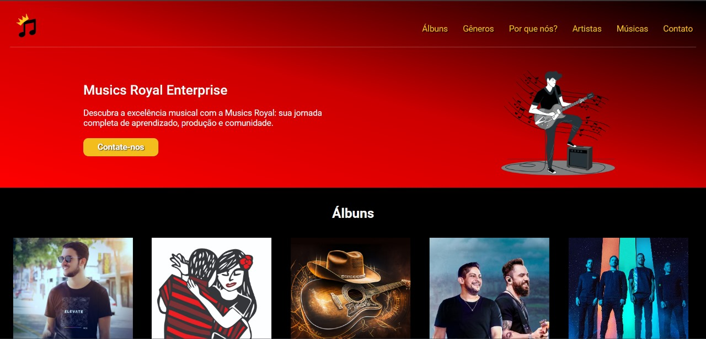

<h2 align="center"> 
	Landing page - Musics Royal 🎵🎶
</h2>

 <a href="#-sobre-o-projeto">Sobre</a> •
 <a href="#-tecnologias">Tecnologias</a> 

 

## 📝 Sobre o projeto

✒️ Projeto realizado com os conhecimentos dos módulos de HTML e CSS do Curso do Desenvolvimento Web;

---

## 🛠 Tecnologias

As seguintes ferramentas foram usadas na construção do projeto:
- **[HTML](https://html.com/)**
    
-   **[CSS](https://www.w3.org/Style/CSS/Overview.en.html)**
      
---